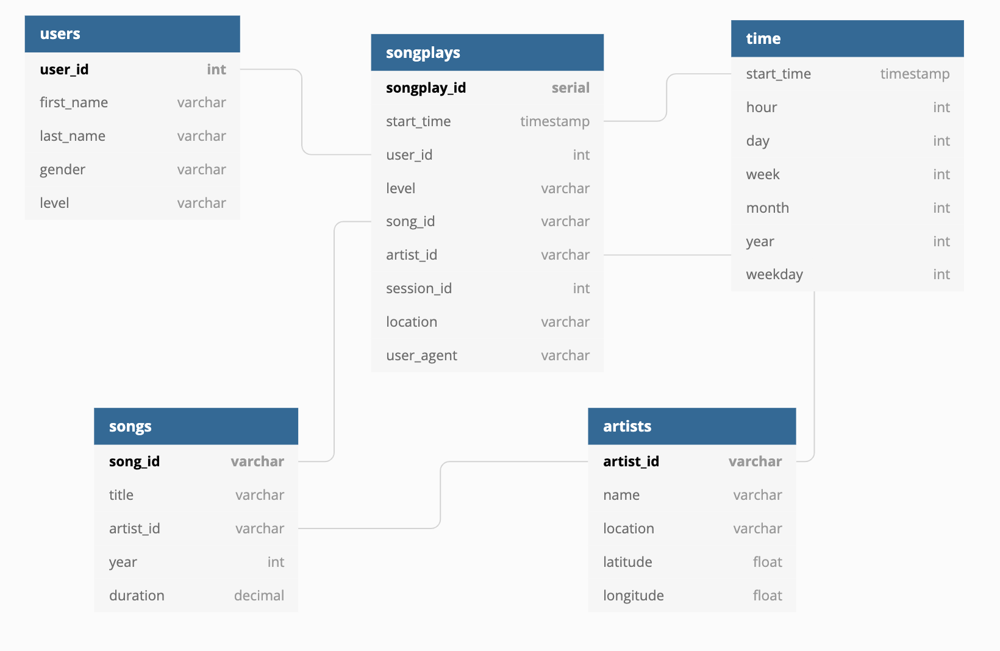

# Spark Data Lake

Sparkify is a music-streaming app. They have user event data and song data in JSON files in an S3 Bucket.
They want to know what songs their users are listening to. This project extracts their data, processes it
with Spark into analytical tables, and writes those tables to parquet files to another S3 Bucket.

### Table structure

#### Data analysis tables

### Files in project

* dl.cfg
   * Config file
* etl.py
   * Pipeline for reading data from an S3 bucket, processing the data with Spark and then writing tables
     to another S3 bucket

### How to execute the project

* Update dl.cfg with your AWS Access Key, AWS Secret Key, and the name of the S3 bucket
  you wish to output the tables to.
* Copy etl.py and dl.cfg into an S3 bucket.
* Create an EMR cluster with the following configurations
  * Release: emr-5.28.0
  * Applications: Spark: Spark 2.4.7 on Hadoop 2.10.1 YARN and Zeppelin 0.9.0
  * Instance type: m5.xlarge
  * Number of instances: 5
  * EC2 key pair: your own key pair
* ssh into the cluster
    * Copy etl.py and dl.cfg from the bucket into the cluster.
        * `$ aws s3 cp s3://<bucket_name>/<filename> .`
    * On the cluster, set the python version to 3.6
        * `$ export PYSPARK_PYTHON=python3.6`
    * Run the pipeline
        * `$ spark-submit etl.py`